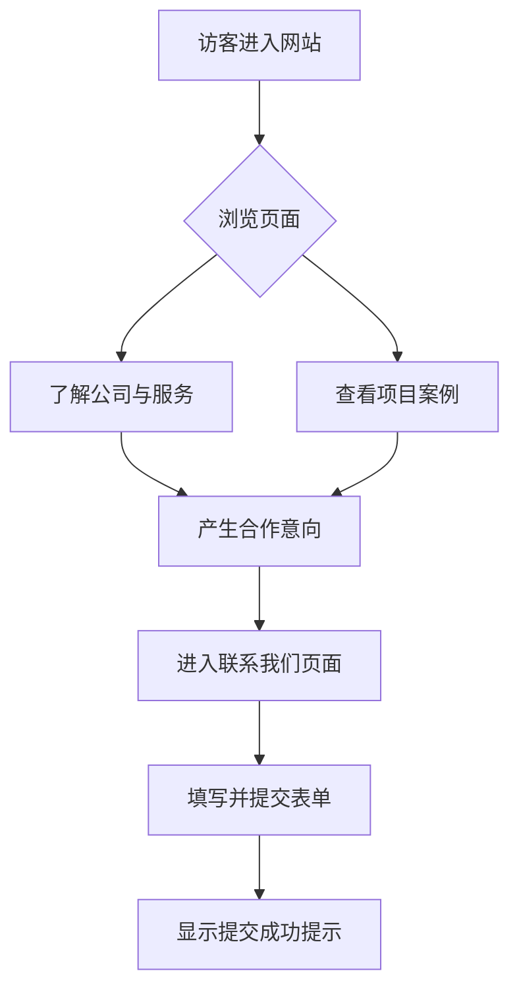

## 1. 产品概述
本项目为泰国光伏EPC（工程、采购、施工）总包项目公司的官方网站。
- 网站旨在展示公司的专业能力、工程案例、服务范围及企业资质，建立专业、可靠、绿色的企业品牌形象，吸引泰国本土及国际潜在客户，促成商业合作。
- 作为企业数字化名片，提升在东南亚新能源市场的品牌竞争力和知名度。

## 2. 核心功能

### 2.1 用户角色
| 角色 | 注册方式 | 核心权限 |
|------|----------|----------|
| 访客 | 无需注册 | 浏览网站所有公开信息，提交合作意向表单 |

### 2.2 功能模块
1. **首页 (Home)**：首屏震撼视觉（Hero区）、公司简介、核心服务概览、精品项目展示、为什么选择我们、联系入口。
2. **关于我们 (About Us)**：企业愿景与使命、发展历程、资质认证、核心团队。
3. **核心服务 (Services)**：EPC全生命周期服务详细介绍（工程设计、全球采购、施工管理、运维服务）。
4. **项目案例 (Projects)**：按类型划分的光伏项目案例（工商业屋顶、地面电站、水面光伏等）。
5. **联系我们 (Contact)**：泰国本地办事处地址、地图导航、在线留言表单。

### 2.3 页面详情
| 页面名称 | 模块名称 | 功能描述 |
|----------|----------|----------|
| 首页 | 首屏轮播/视频 | 展示震撼的光伏电站实景或高质量渲染图，带有明确的标语和行动号召（CTA）。 |
| 首页 | 核心优势 | 图文并茂展示在泰国本土化运营、供应链、技术等方面的核心优势。 |
| 关于我们 | 企业资质 | 展示获得的行业认证、资质证书，增强客户信任。 |
| 核心服务 | 服务卡片 | 详细阐述E、P、C及O&M各个环节的专业能力，可展开查看详情。 |
| 项目案例 | 案例画廊 | 采用网格布局展示不同场景的成功案例，支持点击查看项目详情（如装机容量、交付周期）。 |
| 联系我们 | 留言表单 | 包含姓名、邮箱、电话、需求描述的表单，支持表单验证。 |

## 3. 核心流程
访客浏览与询盘流程：

## 4. 用户界面设计
### 4.1 设计风格
- **主色调**：以环保的**新能源绿**为主色调，代表绿色能源、环保与可持续发展，辅以纯净的白色和浅灰色作为背景，体现清洁与现代感。参考网站 `kgsolar.com` 的整体感觉。
- **背景与留白**：采用大面积的白色和浅灰背景，保证内容阅读的清晰度，体现现代企业的高端感。
- **字体**：使用现代无衬线字体（如 Inter 或 Roboto），标题加粗显得稳重，正文清晰易读。
- **排版风格**：模块化卡片式设计，配合大幅高清背景图和视差滚动效果（Parallax），增加视觉冲击力。
- **微交互**：按钮悬停发光/变色，滚动时卡片元素平滑淡入（Fade-in up），提升高级感。

### 4.2 页面设计概览
| 页面名称 | 模块名称 | UI 元素及效果 |
|----------|----------|---------------|
| 首页 | 首屏 Hero | 全屏背景图加深色遮罩，居中大标题，高亮绿色CTA按钮，伴随缓慢放大动画。 |
| 首页 | 数据统计 | 使用大号字体和计数器动画（如“100+ 交付项目”，“500MW+ 装机容量”）。 |
| 项目案例 | 案例网格 | 图片悬停时放大并显示项目名称及关键数据蒙层。 |

### 4.3 响应式设计（极高优先级）
- **移动端极度友好**：深度优化手机端浏览体验，确保所有内容在小屏幕上可读性极佳。
- 采用移动端优先的思维进行布局优化，包括：底部固定联系悬浮按钮、易于触摸的超大按钮区、折叠式手风琴菜单、以及全屏弹出的汉堡导航。
- 字体和内边距（Padding）在移动端自动缩放，保证内容不拥挤。