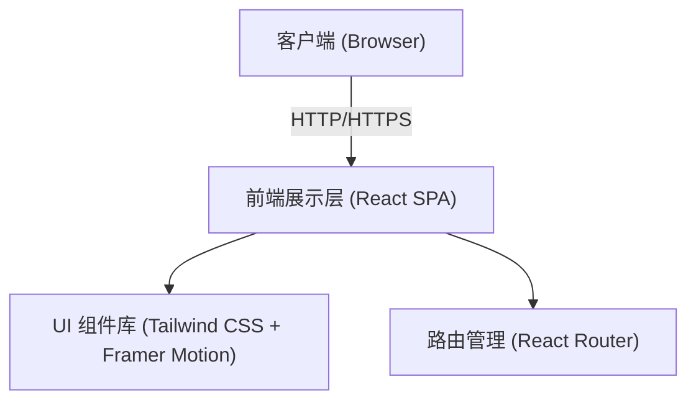

## 1. 架构设计

## 2. 技术说明
- **前端**: React@18 + tailwindcss@3 + vite + typescript
- **初始化工具**: vite-init (由用户环境支持，或直接 `npm create vite@latest . -- --template react-ts`)
- **动画库**: Framer Motion (实现页面平滑滚动、元素出现、悬停等高级微交互动画)
- **图标库**: Lucide React (轻量、简洁的现代图标)
- **表单处理**: React Hook Form (轻量级表单状态管理与验证)

## 3. 路由定义
| 路由 | 页面组件 | 页面用途 |
|------|----------|----------|
| `/` | `Home` | 网站首页，聚合展示核心信息 |
| `/about` | `About` | 关于我们，展示企业实力与背景 |
| `/services` | `Services` | 核心服务，详解EPC各项能力 |
| `/projects` | `Projects` | 项目案例，展示历史业绩 |
| `/contact` | `Contact` | 联系我们，收集客户线索 |

## 4. API 定义
当前为纯前端展示站，暂无后端接口需求。表单提交可以暂时在前端模拟（或者通过 EmailJS 这类服务发邮件）。

## 5. 部署与性能优化
- 静态资源优化：对高清光伏项目图片进行压缩。
- 响应式适配：严格按照 Tailwind 的断点（sm, md, lg, xl）进行多端适配。